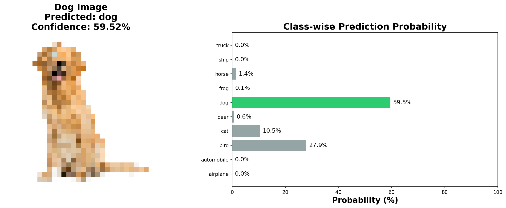
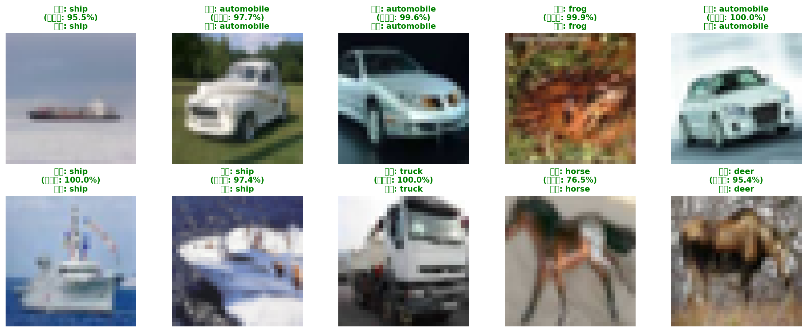
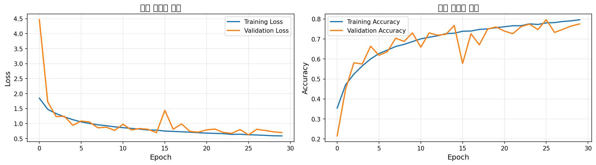

# 02.py 코드 설명: CIFAR-10 이미지 분류기

이 문서는 `02.py`를 보면서 바로 설명할 수 있도록 핵심만 정리한 README입니다. 아래 내용만 포함합니다.

- 코드 설명
- 전체 흐름
- 개념 설명
- 결과물 설명

---

## 1. 코드 설명

`02.py`는 CIFAR-10 데이터셋을 이용해 CNN(합성곱 신경망) 모델을 학습하고, 성능 평가 및 예측 결과 시각화까지 수행하는 코드입니다.

### 1-1. 라이브러리 임포트

- `numpy`: 배열 처리, 무작위 샘플 선택, 최댓값 인덱스 계산
- `matplotlib.pyplot`: 학습 곡선 및 예측 결과 시각화
- `tensorflow.keras`: 모델 구성, 학습, 평가
- `cifar10`: CIFAR-10 데이터셋 로드
- `to_categorical`: 정수 레이블 원-핫 인코딩
- `Adam`: 옵티마이저
- `image`: 외부 이미지(`dog.jpg`) 로드
- `os`: 파일 경로 처리 및 결과 파일 저장

### 1-2. 데이터셋 로드

```python
(train_images, train_labels), (test_images, test_labels) = cifar10.load_data()
```

CIFAR-10 데이터를 학습/테스트 세트로 불러옵니다.

- 학습 이미지: 50,000장
- 테스트 이미지: 10,000장
- 이미지 크기: 32x32 RGB
- 클래스 수: 10

클래스 이름은 `airplane`부터 `truck`까지 10개를 수동 정의해 예측 결과를 사람이 읽기 쉽게 표시합니다.

### 1-3. 데이터 전처리

#### 정규화

```python
train_images_normalized = train_images.astype('float32') / 255.0
test_images_normalized = test_images.astype('float32') / 255.0
```

픽셀 값을 0~255에서 0~1 범위로 변환해 학습 안정성과 수렴을 개선합니다.

#### 원-핫 인코딩

```python
train_labels_categorical = to_categorical(train_labels, 10)
test_labels_categorical = to_categorical(test_labels, 10)
```

정수 레이블을 10차원 벡터로 변환합니다. 예를 들어 클래스 3은 `[0, 0, 0, 1, 0, 0, 0, 0, 0, 0]` 형태가 됩니다.

### 1-4. 모델 설계

`Sequential` 모델로 CNN을 구성합니다.

모델 구성:

1. Conv2D(32) + BatchNormalization + MaxPooling2D + Dropout(0.3)
2. Conv2D(64) + BatchNormalization + MaxPooling2D + Dropout(0.3)
3. Flatten
4. Dense(256, relu) + Dropout(0.5)
5. Dense(10, softmax)

레이어 역할:

- `Conv2D`: 이미지 특징 추출
- `BatchNormalization`: 학습 안정화
- `MaxPooling2D`: 공간 차원 축소
- `Dropout`: 과적합 방지
- `Flatten`: 3차원 특징맵을 1차원으로 변환
- `Dense`: 최종 분류 수행

### 1-5. 모델 컴파일

```python
model.compile(
	loss='categorical_crossentropy',
	optimizer=Adam(learning_rate=0.001),
	metrics=['accuracy']
)
```

- 손실함수: `categorical_crossentropy`
- 옵티마이저: `Adam(learning_rate=0.001)`
- 지표: `accuracy`

### 1-6. 모델 학습

```python
history = model.fit(
	train_images_normalized,
	train_labels_categorical,
	epochs=30,
	batch_size=128,
	validation_split=0.2,
	verbose=1
)
```

학습 파라미터:

- `epochs=30`: 전체 데이터 30회 반복
- `batch_size=128`: 미니배치 크기
- `validation_split=0.2`: 학습 데이터의 20%를 검증에 사용

학습 기록은 `history`에 저장되어 이후 그래프 생성에 사용됩니다.

### 1-7. 모델 평가

```python
test_loss, test_accuracy = model.evaluate(test_images_normalized, test_labels_categorical, verbose=0)
```

테스트 데이터로 최종 손실과 정확도를 계산합니다.

### 1-8. 학습 곡선 시각화

`history`의 손실/정확도 기록으로 그래프를 그려 저장합니다.

- 저장 파일: `training_history.png`
- 내용: Training vs Validation의 Loss/Accuracy 변화

### 1-9. 샘플 예측 시각화

테스트 이미지 10장을 무작위 선택해 예측합니다.

- 예측 라벨
- 신뢰도
- 실제 라벨

을 이미지 위에 표시하고 저장합니다.

- 저장 파일: `sample_predictions.png`

### 1-10. 외부 이미지(`dog.jpg`) 예측

`dog.jpg`가 있으면 32x32로 리사이즈 후 예측합니다.

처리 순서:

1. 이미지 로드
2. 배열 변환
3. 정규화
4. 배치 차원 추가
5. 예측
6. 결과 시각화(예측 클래스 + 클래스별 확률 바차트)

- 저장 파일: `dog_prediction.png`

파일이 없으면 안내 문구를 출력하고 이 단계는 건너뜁니다.

---

## 2. 전체 흐름

`02.py` 실행 흐름은 아래 순서입니다.

1. 라이브러리 임포트
2. CIFAR-10 데이터 로드
3. 정규화 + 원-핫 인코딩
4. CNN 모델 구성
5. 모델 컴파일
6. 모델 학습
7. 테스트 성능 평가
8. 학습 곡선 저장
9. 샘플 예측 결과 저장
10. `dog.jpg` 예측 결과 저장(파일 존재 시)

즉, 앞부분은 데이터 준비, 중간은 모델 학습, 뒷부분은 결과 확인 및 시각화입니다.

---

## 3. 개념 설명

### CIFAR-10

10개 클래스의 32x32 컬러 이미지 분류 데이터셋입니다.

### CNN

이미지에서 특징을 추출하고 분류하는 데 특화된 신경망입니다.

### 정규화

입력 스케일을 맞춰 학습을 안정화하는 과정입니다.

### 원-핫 인코딩

다중 분류에서 레이블을 벡터 형태로 표현하는 방식입니다.

### BatchNormalization

중간 특징 분포를 안정화해 학습을 더 빠르고 안정적으로 만듭니다.

### MaxPooling

특징맵 크기를 줄여 계산량을 줄이고 핵심 특징을 남깁니다.

### Dropout

일부 뉴런을 무작위로 비활성화해 과적합을 완화합니다.

### Softmax

출력층에서 클래스별 확률 분포를 생성합니다.

### categorical_crossentropy

원-핫 레이블 기반 다중분류 손실함수입니다.

---

## 4. 결과물 설명

실행 후 생성/출력되는 결과는 다음과 같습니다.

### 콘솔 출력

- 데이터 형태 정보
- 전처리 상태 정보
- 모델 구조(`model.summary()`)
- 테스트 손실/정확도
- 생성된 파일 경로

### 파일 결과물


`dog.jpg` 예측 결과 및 클래스별 확률 차트


테스트 샘플 10장의 예측 결과 시각화


학습/검증 손실 및 정확도 변화 그래프

해석 포인트:

- 손실은 감소, 정확도는 증가하는 방향이 일반적으로 바람직합니다.
- 샘플 예측 이미지로 모델의 강점/약점을 직관적으로 확인할 수 있습니다.
- 클래스별 확률 차트는 모델의 확신 정도를 판단하는 데 유용합니다.
